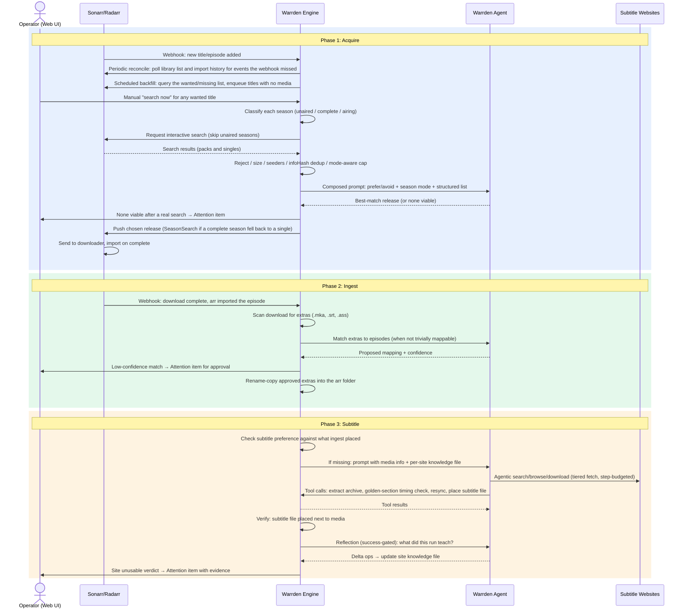

# Pipeline overview

The end-to-end sequence Warrden is built toward. The diagram is the goal, not a snapshot of what is implemented. Lines marked *(gap)* under [Where the diagram is ahead of the code](#where-the-diagram-is-ahead-of-the-code) do not exist yet. Everything else is built.

Phase details live in [Acquire](acquire.md), [Ingest](ingest.md), and [Subtitle](subtitle.md). The engine/agent split is in [Architecture](architecture.md).

## Component view: engine and agent

The "agent" is not a separate process. It is a set of LLM call-sites the engine invokes through the LLM layer. Each call returns structured output the engine then executes. The browse policy returns one action per step. The harness carries that action out through the fetch tiers, so every side effect stays behind the engine's own guards. Arrows point in the direction of "who asks whom".

Self-learning is bracketed around a run, never inside it. The knowledge file is read once at run start. The reflection call happens once after the pipeline has verified the outcome. Mid-run there is only the transcript. See [Site agent](site-agent.md).

Edge colors mark the three nested cycles, innermost first. **Amber** is the per-step browse cycle, repeated up to the step budget within one site run: ask the model for one action, execute it through the guarded tiers, append the result to the transcript, ask again. **Blue** is the per-site outer cycle: the subtitle pipeline runs one full browse loop per configured site, serially, until a subtitle is placed or the list is exhausted. **Green** is the cross-run learning loop: knowledge read once at run start, written back once after the verified outcome, feeding the next run against that site. Uncolored edges run once per job or on their own schedule.

```mermaid
%%{init: {"flowchart": {"defaultRenderer": "elk"}}}%%
flowchart LR
    subgraph Engine["Warrden Engine"]
        direction LR
        subgraph core["Core"]
            api["HTTP API + dashboard<br>server/"]
            webhooks["arr webhooks + reconcile<br>arr/ reconcile/"]
            queue["Job queue + runner<br>jobs/"]
            pipelines["Pipelines<br>acquire / ingest / subtitle"]
        end
        subgraph harness["Agent harness (agent/)"]
            loop["Browse loop<br>step budget, transcript"]
            tiers["Fetch tiers<br>curl / chromium"]
            guard["Destination guard<br>SSRF, redirect re-check"]
            knowledge["Site knowledge store<br>one file per site"]
            scanner["Threat scanner<br>injection tripwire"]
            reflectApply["Reflection applier<br>delta ops, success gate"]
        end
        subgraph toolbox["Media toolbox: media/ + subtitle pipeline"]
            extractT["Archive extract"]
            driftT["Drift check<br>embedded-track reference"]
            syncT["Timing sync<br>alass / ffsubsync"]
            placeT["Sidecar place + verify"]
        end
        llm["LLM layer<br>one model, call-site labels,<br>prompt cache"]
        db[("SQLite<br>jobs, profiles, events,<br>attention")]
    end

    subgraph Agent["Warrden Agent: LLM call-sites<br>(one model, no site access)"]
        pickC["Release picker<br>call-site: release-pick"]
        mapC["Extras + archive mappers<br>call-sites: sidecar-match,<br>bundle-map, archive-map"]
        browseC["Browse policy, one action per step<br>call-site: site-search"]
        reflectC["Reflection<br>call-site: site-notes"]
    end

    arr["Sonarr / Radarr"]
    sites["Subtitle websites"]

    arr -->|webhook events| webhooks --> queue --> pipelines
    webhooks -->|reconcile poll:<br>library list, import history| arr
    api -->|manual triggers:<br>search now, retry, repick| queue
    pipelines -->|interactive search,<br>push release| arr
    pipelines --> llm
    pipelines -->|one browse run<br>per configured site| loop
    loop -->|per-step prompt| llm
    loop -->|outcome: downloaded archive,<br>or gave up → try next site| pipelines
    pipelines -->|runs after the loop<br>hands off the download| toolbox
    llm -->|prompt| pickC & mapC & browseC & reflectC
    knowledge -->|read once at run start,<br>injected into the prompt| loop
    scanner -.->|checks every load<br>and every write| knowledge
    browseC -->|"structured action<br>search / open / download /<br>request / give_up"| loop
    loop -->|executes each action| tiers
    tiers -->|checks every destination| guard
    tiers -->|guarded fetch| sites
    reflectC -->|delta ops: one call per site run,<br>after the outcome is verified| reflectApply -->|surviving ops only| knowledge
    extractT --> driftT --> syncT --> placeT
    pipelines --> db
    api --> db

    %% Amber: the per-step browse cycle (loop -> llm -> browse policy -> loop -> tiers),
    %% repeated up to the step budget. Blue: the per-site outer cycle (one browse run
    %% per configured site, serially). Green: the cross-run learning loop (knowledge
    %% read at run start, written back once after the verified outcome).
    %% linkStyle indexes edges by definition order. Recount after adding or removing edges.
    linkStyle 8,13,17,18,19,20 stroke:#f59e0b,stroke-width:2px
    linkStyle 7,9 stroke:#3b82f6,stroke-width:2px
    linkStyle 15,21,22 stroke:#22c55e,stroke-width:2px
```

## Where the diagram is ahead of the code

- Scheduled backfill and the manual "search now" button *(gap)*. Reconcile only catches missed add events. It cannot see a title that was already in the library at bootstrap, or one that was searched once and found nothing. See [Deferred gaps](deferred-design-gaps.md).
- The re-search loop behind a "none viable" verdict *(gap, same item)*. The Attention item exists. The automatic retry behind it does not.
- Timing sync is real: `alass` with an `ffsubsync` fallback is wired into the subtitle pipeline. A drifted subtitle gets resynced and then placed or quarantined. What does not exist is a golden-section or VAD timing reference for files with no embedded subtitle track *(gap)*. Those place as `unverified` today, which is why the component view says "embedded-track reference".
